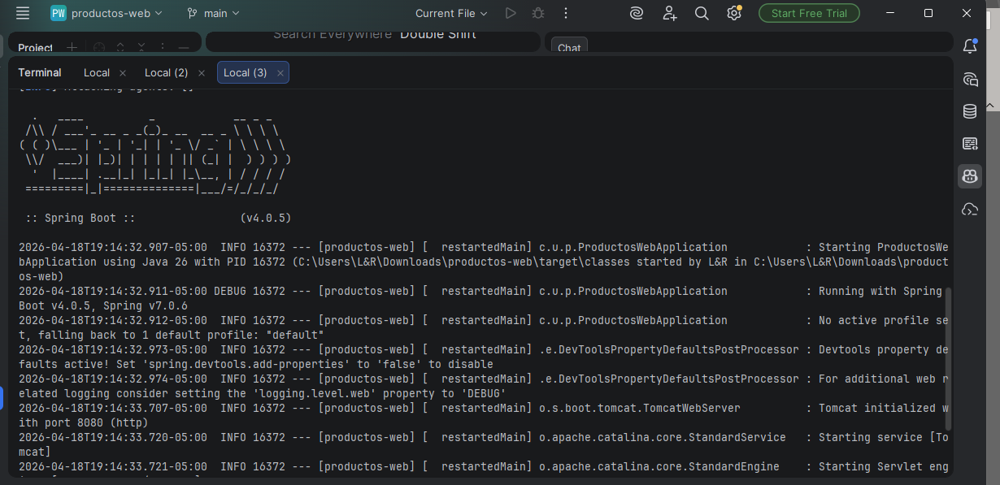
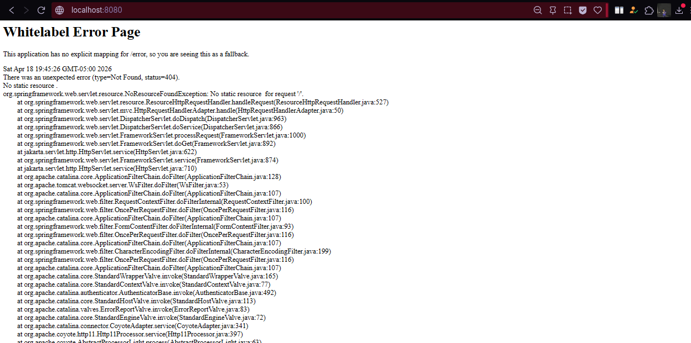
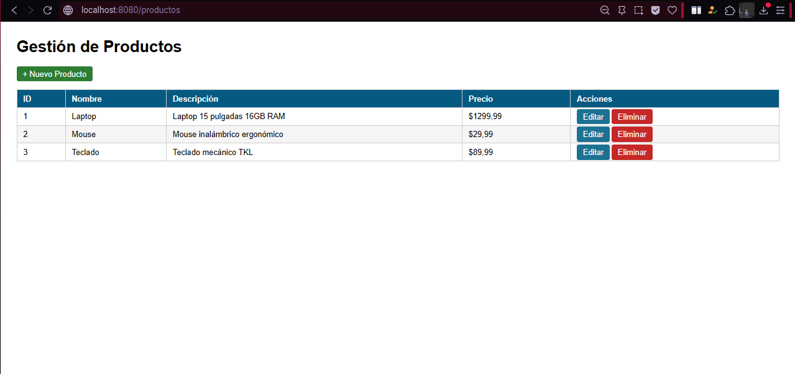
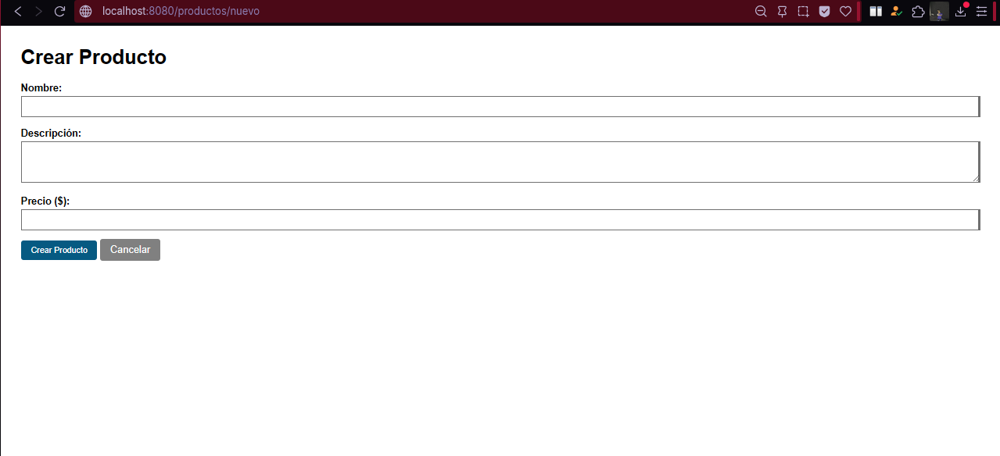
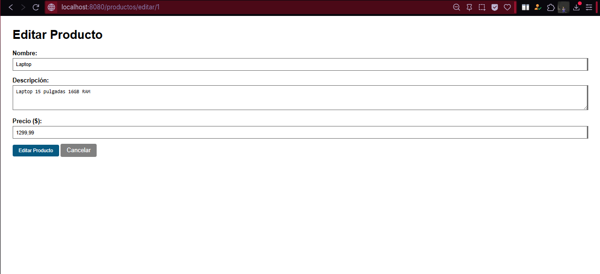
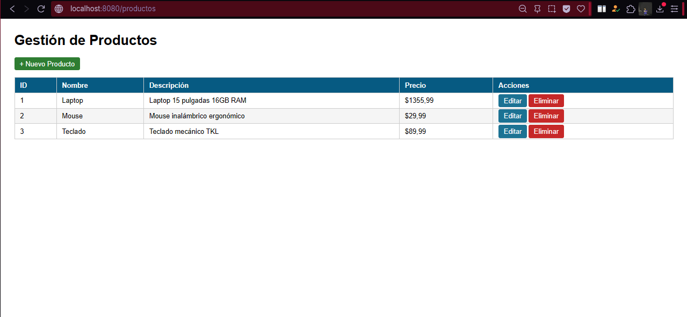
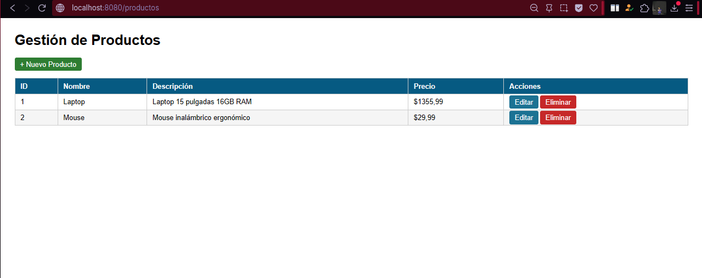

# CRUD de Productos con Spring Boot + Thymeleaf (MVC)

Este proyecto es una aplicación web CRUD completa para la gestión de productos, desarrollada con Spring Boot, Thymeleaf y una lista en memoria como persistencia temporal. Implementa el patrón MVC y el patrón Post/Redirect/Get (PRG) para el procesamiento de formularios.

## Autor

- **Nombre:** Jhoseth Esneider Rozo Carrillo
- **Código:** 02230131027
- **Programa:** Ingeniería de Sistemas
- **Asignatura:** Programación Web
- **Unidad:** 7 - Spring Boot Básico
- **Actividad:** Post-Contenido 1
- **Año:** 2026

---

## Descripción del Proyecto

La aplicación permite:

- Listar productos registrados.
- Crear nuevos productos mediante un formulario.
- Editar productos existentes.
- Eliminar productos con confirmación.

Se utiliza:

- Spring Boot → Backend
- Thymeleaf → Motor de vistas
- HashMap en memoria → Persistencia temporal
- Patrón PRG (Post/Redirect/Get) → Manejo de formularios

---

## Prerrequisitos

Antes de ejecutar el proyecto, asegúrate de tener:

| Requisito     | Detalle                 |
| ------------- | ----------------------- |
| Java          | JDK 17 o superior       |
| Maven         | 3.8+ o usar `mvnw`      |
| IDE           | IntelliJ IDEA o VS Code |
| Navegador     | Chrome o Firefox        |
| Conocimientos | MVC, HTTP GET/POST      |

---

## Estructura del Proyecto

- productos-web/
- ├── src/main/java/com/universidad/productosweb/
- │ ├── ProductosWebApplication.java
- │ ├── controller/
- │ │ └── ProductoController.java
- │ ├── model/
- │ │ └── Producto.java
- │ └── service/
- │ └── ProductoService.java
- │
- ├── src/main/resources/
- │ ├── application.properties
- │ ├── static/
- │ └── templates/
- │ └── productos/
- │ ├── lista.html
- │ └── formulario.html
- │
- ├── pom.xml
- ├── mvnw
- └── mvnw.cmd

---

## Tecnologías Utilizadas

- Java 17
- Spring Boot 4.0.x
- Thymeleaf
- Maven
- Spring Boot DevTools

---

## Instrucciones de Ejecución

### 1. Clonar el repositorio

git clone https://github.com/jerc31/rozo-post1-u7.git

### 2. Abrir en IntelliJ IDEA

### 3. Navega al directorio raíz del proyecto.

### 4. Ejecuta el comando: mvn spring-boot:run

### 5. Abre un navegador y accede a http://localhost:8080/productos

---

## Checkpoints de Verificación

La aplicación inicia sin errores

- Se muestran 3 productos precargados
- Se puede crear un producto
- Se puede editar un producto
- Se puede eliminar un producto
- No hay reenvío de formularios (PRG funcionando)

## Capturas de pantalla

Las siguientes capturas se encuentran en la carpeta `/evidencias/`:

# Spring boot consola

## Error por rutas

## Lista de 3 productos

## Agregar producto

## Editar producto

## Guardar edición de producto

## Eliminar producto cumpliendo el patrón PRG

